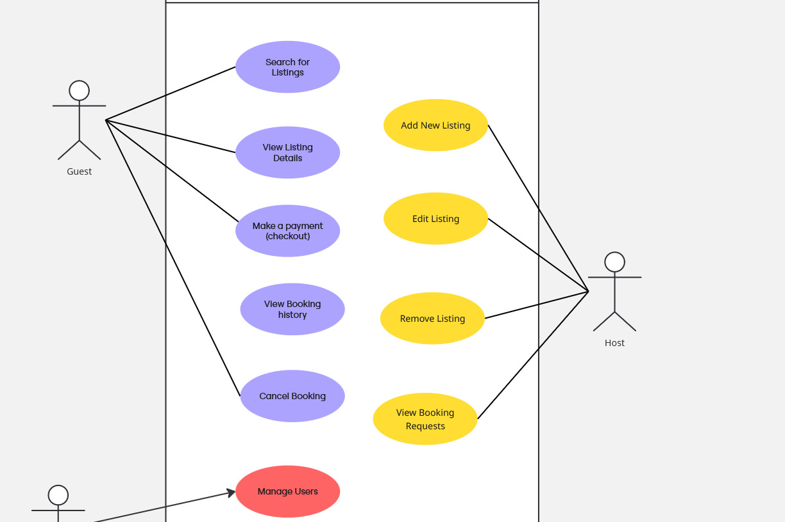

# Airbnb Clone Frontend – ALX Milestone

This project is part of the ALX Software Engineering training. It focuses on building the frontend for an Airbnb-style booking management system while applying the principles of Requirement Analysis within the Software Development Life Cycle (SDLC).

---

## What is Requirement Analysis?

Requirement Analysis is a critical phase in the software development lifecycle (SDLC) where the project team gathers, analyzes, and defines the requirements of the software product to be developed. This process ensures that all stakeholders have a clear and mutual understanding of what the system should do and how it should perform.

## Why is Requirement Analysis Important?

Requirement Analysis is a crucial step in the SDLC because it ensures the solution being developed aligns with business goals, user needs, and system feasibility. It reduces the chances of costly rework later in the process. Here are three key reasons why it is important:

1. **Clarity and Shared Understanding**  
   - It ensures that both stakeholders and the development team have a clear, common understanding of what the system should achieve.  
   - Prevents misinterpretations and scope creep.

2. **Early Detection of Issues**  
   - Identifies potential risks, conflicts, or missing requirements before actual development begins.  
   - Saves time and cost by resolving issues in the planning phase rather than after deployment.

3. **Foundation for Design and Development**  
   - Provides the blueprint for system design and architecture.  
   - Developers, testers, and project managers rely on these requirements to build and validate the system.

---

## Key Activities in Requirement Analysis

1. **Requirement Gathering**  
   Collecting inputs from stakeholders, users, business documents, and market research to understand what the system needs to achieve.

2. **Requirement Elicitation**  
   Engaging with stakeholders through interviews, surveys, observations, and workshops to extract their needs and expectations.

3. **Requirement Documentation**  
   Clearly recording all requirements in formats such as Software Requirement Specifications (SRS) or user stories for easy reference.

4. **Requirement Analysis and Modeling**  
   Breaking down and analyzing requirements to ensure they are consistent, complete, and feasible.  
   Modeling techniques like use case diagrams and process flows may be used.

5. **Requirement Validation**  
   Confirming with stakeholders that the documented requirements accurately reflect their needs before proceeding with development.

---

## Types of Requirements

### Functional Requirements
Functional requirements describe **what the system should do**—the core features and functions.  
**Examples for the booking management system:**
- A user should be able to search for available listings by location, date, and price.  
- A host should be able to add, edit, and remove property listings.  
- The system should allow users to make payments and confirm bookings.  
- Users should be able to view their booking history.

### Non-functional Requirements
Non-functional requirements describe **how the system performs** its functions, focusing on qualities rather than behaviors.  
**Examples for the booking management system:**
- The system should respond to user search queries within 2 seconds.  
- The application should support at least 10,000 concurrent users.  
- The frontend should be accessible on both desktop and mobile devices.  
- The platform should comply with secure payment standards (e.g., PCI-DSS).

---

## Use Case Diagrams

**What are Use Case Diagrams?**  
Use case diagrams are a visual representation of system functionality and interactions between users (actors) and the system. They help identify the main actors, their goals, and the boundaries of the system.

**Benefits of Use Case Diagrams:**
- Provide a simple and intuitive way to capture system behavior.  
- Help in validating requirements with stakeholders.  
- Serve as a bridge between business needs and technical design.

**Booking System Use Case Diagram:**  
Actors include:  
- **Guest** (searches, books, pays)  
- **Host** (manages listings)  
- **Admin** (manages users, handles disputes)  

---

## Acceptance Criteria

**Importance of Acceptance Criteria:**  
Acceptance Criteria are the conditions that must be met for a feature to be considered complete and working as intended. They:  
- Define the boundaries of a user story.  
- Ensure alignment between developers, testers, and stakeholders.  
- Provide a basis for test cases.

**Example – Checkout Feature:**  
*As a Guest, I want to complete a booking and pay securely so that I can confirm my stay.*  

**Acceptance Criteria:**  
- User must be able to see a responsive checkout page with booking summary (property details, dates, price breakdown).
- Input fields for payment details (e.g., card number, expiry, CVV) should validate format in real-time before submission.
- Buttons such as “Confirm Payment” and “Cancel” must be clearly visible and functional.
- If payment is successful (confirmed by backend response), the UI should show a confirmation screen with booking details.
- If payment fails (backend error response), the UI should show a clear error message and allow retry without page refresh.
- The UI must remain responsive across desktop and mobile views.
---
